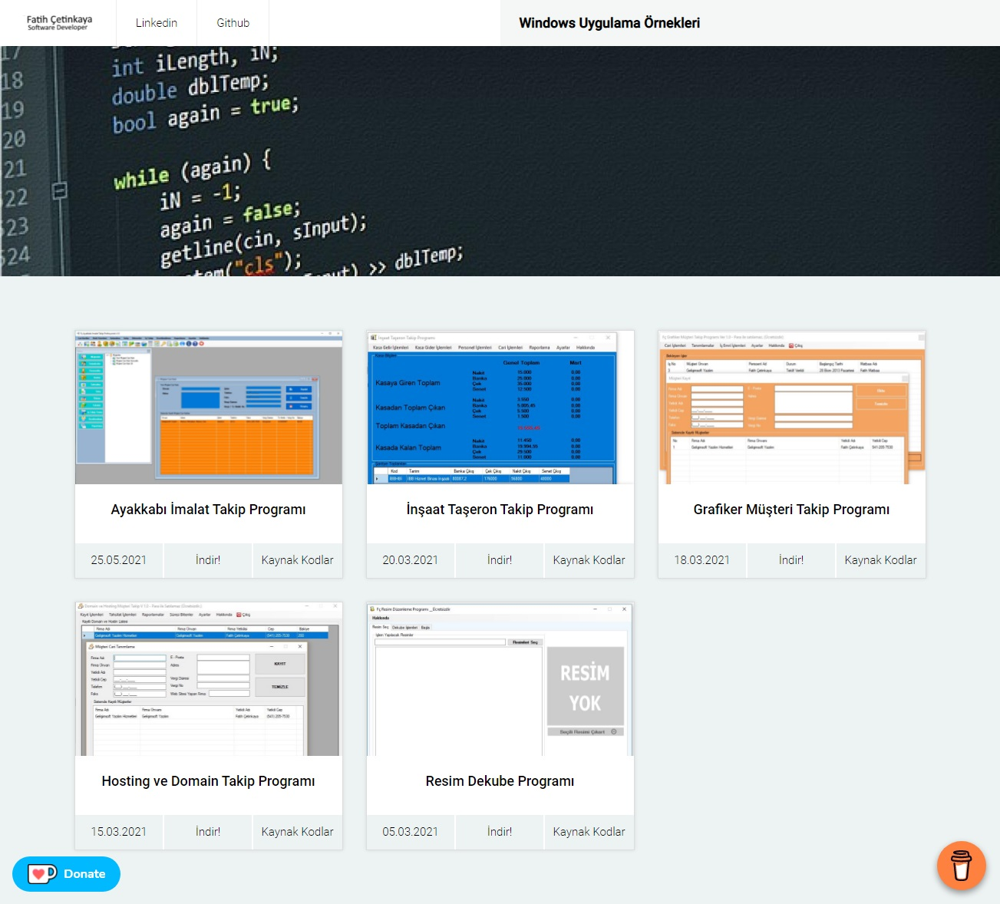

# Windows Uygulama Örnekleri
C# ve Windows masaüstü uygulama yazılım konusunda kendisini geliştirmek isteyenler için hazırlanmıştır.


## Table of contents
* [General info](#general-info)
* [Screenshots](#screenshots)
* [Demo](#demo)
* [Projects](#Projects)
* [Code Examples](#code-examples)

## General info
C# ve Windows masaüstü uygulama yazılım konusunda kendisini geliştirmek isteyenler için hazırlanmıştır. Access veritabanı kullanılmıştır. OOP yapısı ve klasik .net yapısını öğreneceksiniz.

## Demo
https://windows-uygulama-ornekleri.firebaseapp.com/

## Screenshots



## Projects
1. Ayakkabı Takip Programı
2. İnşaat Taşeron Takip Programı
3. Grafiker Müşteri Takip Programı
4. Hosting ve Domain Takip Programı
5. Resim Dekube Programı

## Code Examples
Show examples of usage:
```
  DialogResult dlg = MessageBox.Show("İş Emri Sisteme Kaydedilsin mi?", "Kaydetme Onay", MessageBoxButtons.YesNo, MessageBoxIcon.Information);

            if (dlg == DialogResult.Yes)
            {
                if (con.State == ConnectionState.Closed)
                {
                    con.Open();
                }
                try
                {
                    OleDbCommand com = new OleDbCommand("Insert Into IsEmri(MusteriID,YapilanIsID,Kontrol,PersonelID,MatbaaID,Baslangic) values(@M,@Y,@K,@P,@MID,@B)", con);
                    com.Parameters.AddWithValue("@M", Convert.ToInt32(mustericombo.SelectedValue));
                    com.Parameters.AddWithValue("@Y", Convert.ToInt32(Yapilancombo.SelectedValue));
                    com.Parameters.AddWithValue("@K", durumcombo.Text.ToString());
                    com.Parameters.AddWithValue("@P", Convert.ToInt32(personelcombo.SelectedValue));
                    com.Parameters.AddWithValue("@MID", Convert.ToInt32(Matbaacombo.SelectedValue));
                    com.Parameters.AddWithValue("@B", dateTimePicker1.Value.ToLongDateString());
                    if (com.ExecuteNonQuery() > 0)
                    {
                        MessageBox.Show("Kayıt Yapıldı.");
                    }
                }
                catch (Exception Ex)
                {
                    MessageBox.Show(Ex.ToString());
                }
                finally { con.Close(); }
            }

```
